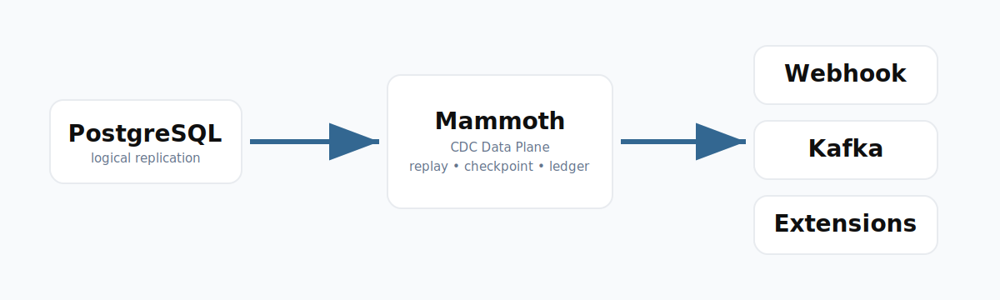

# Mammoth Diagrams

Mammoth architecture diagrams should communicate operational flow clearly.

## Primary Diagram

## Diagram Language

- White cards on light gray backgrounds
- PostgreSQL Blue arrows
- Short labels
- No decorative 3D effects
- No generic clip art

## Canonical Flow

PostgreSQL logical replication flows into Mammoth. Mammoth owns delivery
correctness, replay, the contiguous checkpoint watermark, routing, fan-out, the
delivery ledger, and operational state. pgoutput-client owns the transport
feedback mechanism; Mammoth supplies it only with durably safe acknowledged
progress. Downstream systems are destinations, not Mammoth's source of truth.
